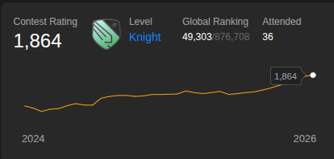
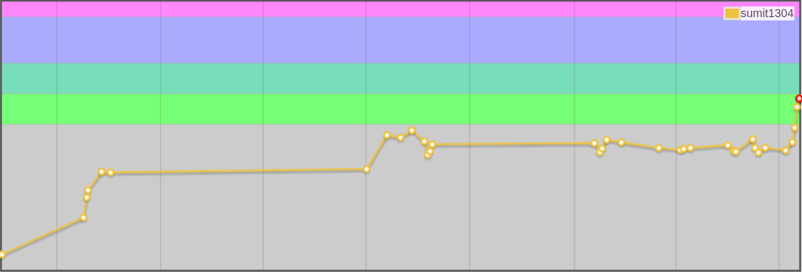

[](https://martinheinz.dev/)


</div>


```json
{
  "email"     : "sumitsahu1304@gmail.com",
  "phone"     : "+91 6009022247",
  "linkedin"  : "sumit-sahu-a3453b289",
  "leetcode"  : "sahu_SuMiT",
  "codeforces": "sumit1304",
  "github"    : "sahu-sumit"
}
```

<p align="center">
  <a href="https://www.linkedin.com/in/sumit-sahu-a3453b289/"></a>
  <a href="https://leetcode.com/u/sahu_SuMiT/"></a>
  <a href="https://codeforces.com/profile/sumit1304"></a>
  <a href="https://github.com/sahu-sumit"></a>
  <a href="mailto:sumitsahu1304@gmail.com"></a>
</p>

<p align="center">
  
</p>

---


```text
[OK] education     : B.Tech CSE @ IIIT Gwalior (2023-2027) | GPA 8.21
[OK] current_job   : Software Developer Intern @ Morgan Soft Innovations
[OK] side_gig      : Partner Apprentice @ Kotak Mahindra Bank
[OK] past_jobs     : Team Lead Intern @ Techori | SDE Intern @ Bluestock Fintech
[OK] award         : Amazon ML Summer School '26
[OK] leetcode      : 1815+ rating
[OK] codeforces    : 1369+ rating
[OK] dsa_solved    : 700+ problems
[OK] currently_learning : Go, Kubernetes, distributed systems
[DONE] process exited with code 0
```

---
<p align="left">
  
</p>

```text
[Dec 2025 - Jul 2026] Kotak Mahindra Bank            :: Partner Apprentice
                       > retail banking, KYC, digital banking systems

[May 2026 - Jul 2026] Morgan Soft Innovations        :: Software Developer Intern
                       > built job platform: resume parsing, NLP role matching,
                         assessments, recruiter dashboards, report generation

[May 2025 - Jul 2025] Techori                        :: Team Lead Intern
                       > JWT + RBAC apps, Firebase, real-time data, UI + deploy

[Feb 2025 - Apr 2025] Bluestock Fintech               :: SDE Intern
                       > agile MERN dev, JWT auth, Postgres schema + indexing
```

---


<table>
<tr><td>

**`git-cicd-actions/`**
```
lang: Go, Docker, GitHub Actions
```
Go service that clones repos and runs full build pipelines — checkout → install → compile → test → artifact. Concurrent execution via goroutines, worker queues, timeouts, retries.
`→` [source](https://github.com/sahu-sumit/ci-cd-runner)

</td><td>

**`kubernetes-pod-manager/`**
```
lang: Go, Kubernetes, Postgres, Prometheus
```
Go backend using `client-go` to create/delete/restart/monitor Pods & Deployments. Deployed with Services, ConfigMaps, Secrets, Ingress.
`→` [source](https://github.com/sahu-sumit/kubernetes-pod-manager)

</td></tr>
<tr><td>

**`campusconnect/`**
```
lang: MERN, Redux, JWT, SSR
```
Campus recruitment platform — REST APIs for postings, applications, interview scheduling, and MongoDB aggregation-based analytics.
`→` [source](https://github.com/sahu-sumit/campus_connect) `→` [demo](https://campusconnect-mocha-nine.vercel.app/)

</td><td>

**`nextmeet/`**
```
lang: React, Node.js, WebRTC, Socket.io
```
Peer-to-peer video chat app with global chat, concurrent connections, Firebase-authenticated sessions.
`→` [source](https://github.com/sahu-sumit/nextmeet) `→` [demo](https://nextmeetvideochat.vercel.app/)

</td></tr>
</table>

---


```yaml
languages:   [C/C++, Java, Python, JavaScript, TypeScript, Go, SQL]
frameworks:  [React.js, Next.js, Node.js, Express.js, Tailwind CSS, Redux Toolkit]
databases:   [MongoDB, PostgreSQL, Firebase]
cloud_devops: [AWS (EC2, S3), Docker, Kubernetes, Git, GitHub Actions, Vercel, Linux]
core:        [DSA, System Design, REST APIs, OOP, DBMS, OS, Cryptography (TLS, HMAC, AES)]
```


---


```text
[26] Amazon ML Summer School            — selected learner
[24] Robo Race Runner-up                — Infotsav, ABV-IIITM Gwalior
[24] Merit Cum Means (MCM) Scholarship  — outstanding merit
[23] Reliance Foundation Scholarship    — academic excellence
```

---


<p align="center">
  
</p>

<p align="center">

  

  
  
  
</p>
---


<p align="center">
  <a href="https://www.linkedin.com/in/sumit-sahu-a3453b289/"></a>
  <a href="mailto:sumitsahu1304@gmail.com"></a>
  <a href="tel:+916009022247"></a>
</p>

<div align="center">


</div>


